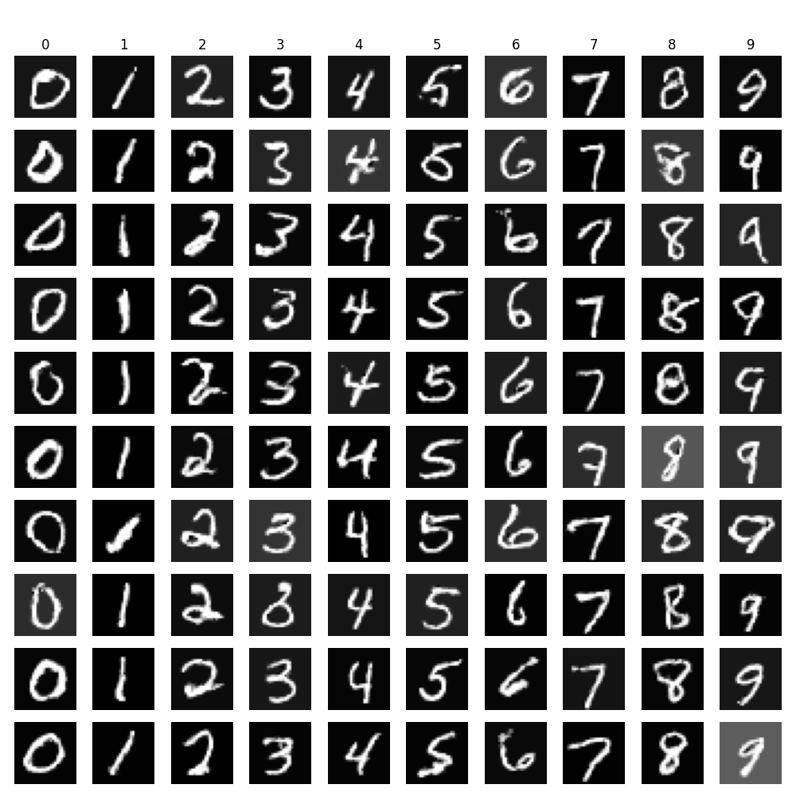
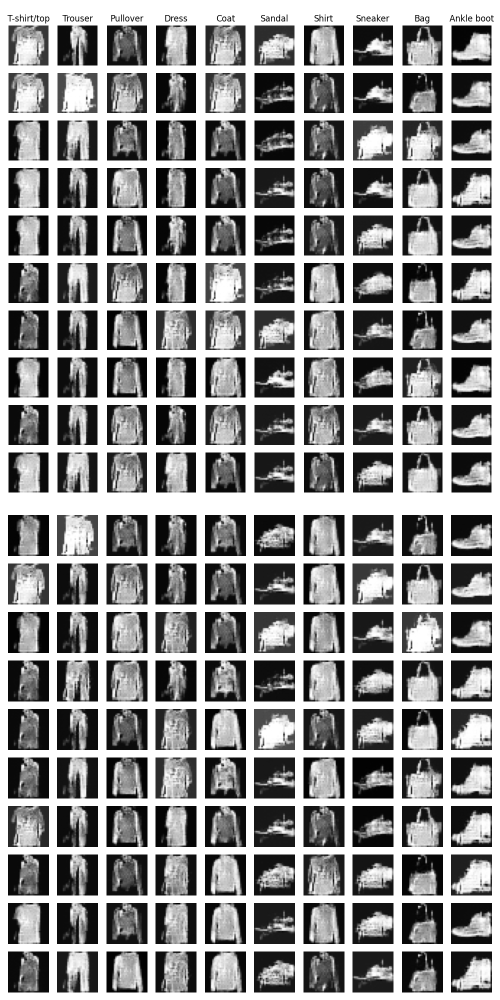

# Conditional Adversarial Networks in Tensorflow

## Adapted from
https://towardsdatascience.com/cgan-conditional-generative-adversarial-network-how-to-gain-control-over-gan-outputs-b30620bd0cc8
### MNIST 

### Fashion MNIST

## Datasets
The model is trained on two datasets: ['mnist', 'fashion_mnist']

## Tensorflow implementation
Install the required packages for the Tensorflow-based cGan:

    pip install -r requirement.txt

## Training and testing the model
### All the datasets can be run on default settings: 

    python main.py --dataset_name [insert here] --mode train
    python main.py --dataset_name [insert here] --mode test 

e.g

    python main.py --dataset_name horse2zebra --mode train
    python main.py --dataset_name horse2zebra --mode test 

## Utils

You can list available physical devices on your computer with

    python main.py --utils list_devices

Sample and plot from a chosen dataset

    python main.py dataset_name [insert here] --utils viz_data

Print and plot network architecture

    python main.py --utils summary_networks

## Results

### Final trained model
#### MNIST 

#### Fashion MNIST

