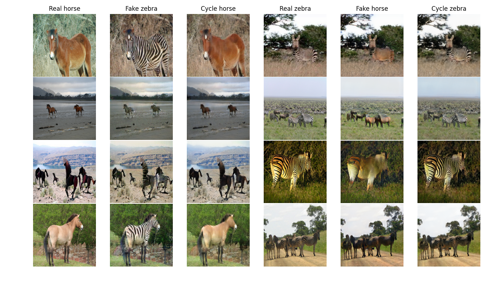
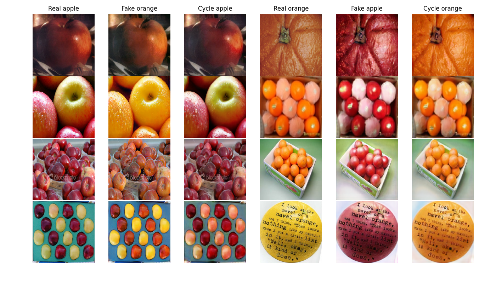
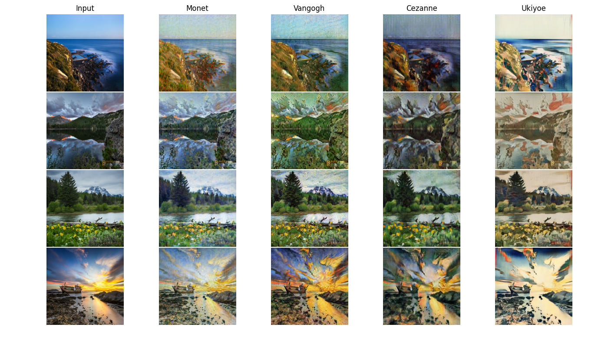

# CYCLEGAN in Tensorflow

## Paper 
https://arxiv.org/pdf/1703.10593.pdf

Image fetched from: https://github.com/junyanz/pytorch-CycleGAN-and-pix2pix/blob/master/README.md

## Datasets
The datasets are downloaded: http://efrosgans.eecs.berkeley.edu/cyclegan/datasets

Available datasets for this project are: 
['apple2orange', 'summer2winter_yosemite', 'horse2zebra', 'monet2photo', 'cezanne2photo', 'ukiyoe2photo', 'vangogh2photo', 'iphone2dslr_flower']

## Tensorflow implementation
Install the required packages for the Tensorflow-based CYCLEGAN:

    pip install -r requirement.txt

## Training and testing the model
### All the datasets can be run on default settings: 

    python main.py --dataset_name [insert here] --mode train
    python main.py --dataset_name [insert here] --mode test 

e.g

    python main.py --dataset_name horse2zebra --mode train
    python main.py --dataset_name horse2zebra --mode test 

## Utils

You can list available physical devices on your computer with

    python main.py --utils list_devices

Sample and plot from a chosen dataset

    python main.py dataset_name [insert here] --utils viz_data

Print and plot network architecture

    python main.py --utils summary_networks

## Results

### Examples of results
#### Horse <-> Zebra

#### Video Horse -> Zebra

    

#### Video Zebra -> Horse

    

#### Apple <-> Orange

#### Collection Style Transfer
Transferring input images into artistic styles of Monet, Van Gogh, Ukiyo-e, and Cezanne. 

### For additional results, checkout the [pictures/additional](pictures/additional) folder 

