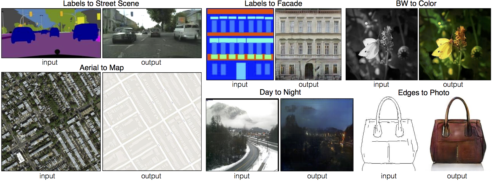

# Image-to-Image Translation with Conditional Adversarial Networks

## Paper
https://arxiv.org/pdf/1611.07004.pdf

Picture fetched from: https://phillipi.github.io/pix2pix/

## Dataset
The datasets are downloaded from: http://efrosgans.eecs.berkeley.edu/pix2pix/datasets

Available datasets are:
['cityscapes', 'edges2handbags', 'edges2shoes', 'facades', 'maps', 'night2day', 'pokemon_pix2pix_dataset']

For edges2pokemon you need to download it manually from Kaggle, and place it in a folder named 'data' and name it 'pokemon_pix2pix_dataset':
https://www.kaggle.com/datasets/norod78/sketch2pokemon 

## Tensorflow implementation
Install the required packages for the Tensorflow-based PIX2PIXs:

    pip install -r requirement.txt

## Training and testing the model
### Datasets that can be run on default: 
facades, cityscapes, map

    python main.py --dataset_name [insert here] --mode train
    python main.py --dataset_name [insert here] --mode test 

e.g

    python main.py --dataset_name facades --mode train
    python main.py --dataset_name faces --mode test 

### Datasets that can not be run default and requires other settings: 
edges2shoes, edges2handbags, night2day, pokemon_pix2pix_dataset

    python main.py --dataset_name [insert here] --batch_size 4 --epochs 15 --mode train
    python main.py --dataset_name [insert here] --mode test 

e.g

    python main.py --dataset_name edges2shoes --batch_size 4 --epochs 15 --mode train
    python main.py --dataset_name edges2shoes  --mode test 

## Utils

You can list available physical devices on your computer with

    python main.py --utils list_devices

Sample and plot from a chosen dataset

    python main.py dataset_name [insert here] --utils viz_data

Print and plot network architecture

    python main.py --utils summary_networks

## Results

### Examples of results

#### Semantic to cityscapes

#### Semantic to facades

#### Maps

#### Edges to handbags

#### Edges to shoes

#### Sketches to pokemon

#### Live drawing and coloring pokemons

    

#### For additional results, checkout the [pictures/additional](pictures/additional) folder 

